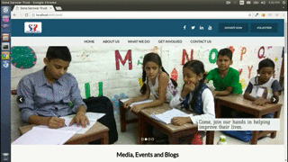

# SonaSarovarTrust

## Table of contents

  * [SonaSarovarTrust](#sonasarovartrust)
  * [Table of contents](#table-of-contents)
  * [Overview](#overview)
  * [Website's Overall Structure](#websites-overall-structure)
    * [UI For Visitors](#ui-for-visitors)
    * [Admin Panel for Dynamic Website](#admin-panel-for-dynamic-website)
  * [Salient Features](#salient-features)
    * [Single Page App](#single-page-app)
    * [Online Payment Gateway Integration](#online-payment-gateway-integration)
    * [Deployed On EC2](#deployed-on-ec2)
    * [Asynchronous Site Updates](#asynchronous-site-updates)
    * [Live Preview](#live-preview)
  * [Technologies Used](#technologies-used)
    * [Node](#1-node)
    * [Npm](#2-npm)
    * [Express](#3-express)
    * [ESLint](#4-eslint)
    * [MongoDB](#5-mongodb)
    * [Mongoose](#6-mongoose)
    * [Sass](#7-sass)
    * [React](#8-react )
    * [Redux](#9-redux)
    * [React-Router](#10-react-router)
    * [Webpack](#11-webpack)
    * [Mocha](#12-mocha)
    * [Git](#13-git)
  * [Branches](#branches)

## Overview

This is a **Full Stack** single page web application for a
Non-Profit Organisation [SonaSarovarTrust](http://www.sonasarovartrust.org).

## Website's Overall Structure

The website is broken into two major sections.

 ### UI For Visitors

 

 This section is accessible to both the **web admins** and **visitors**.

 This section has an engaging UI where visitors can get following information -
   * Trust's aims and objectives
   * Trust's accomplishments
   * Project & Activities undertaken by the Trust
   * Ways to get in touch with the Trust's admins in case one needs
     to volunteer
   * Trust's contact info
   * Testimonials and Awards given to the Trust to validate the Trust
   * Multiple ways (online & offline) to donate to the trust, in case somebody to would
     like to make a donation

 ### Admin Panel for Dynamic Website

 

 This section is accessible **only** to the **admins**.

 A lot of activity happens in this organisation, like starting new
 projects, sponsoring more children, taking part in social activities to
 raise awareness, etc. And the Trust's admins keep needing to update the website
 with new information (**pictures**, **announcements**, etc). Because of this
 the website could not be static.

 And since the site admins have limited technical knowledge, it was important
 to build a platform for them so that they can modify the website with ease.

 This Admin Panel solves that purpose. Using it the webiste's admins have been able
 to modify and update the site effortlessly.

## Salient Features

 ### Single Page App

 This is a [Single Page Application](https://en.wikipedia.org/wiki/Single-page_application).
 This means once the website loads, when the User moves to a different route, new pages will
 **not** be requested from the server. On the contrary the browser will simply load the
 appropriate page.

 ### Online Payment Gateway Integration

 

 This website has been integrated with [Instamojo](https://www.instamojo.com)'s online payment
 gateway so that if anyone wants to make a donation. They can do it with ease.

 ### Deployed On EC2

 Deployed on EC2 as EC2 provides simple, efficient and secure way to deploy any website on their
 servers.

 ### Asynchronous Site Updates

 Whatever changes are made to the site, they are asynchronous in nature, so the admin gets
 immediate feedback on their actions and they don't have to reload the site to see changes.

 ### Live Preview

 After making changes to the website, the admin can click on the Preview button to see the changes.
 They do not have type the url of the Visitor website's url.

## Technologies Used

| Technology                       | Purpose                          | Official Website                                                             |
|:---------------------------------|:---------------------------------|:-----------------------------------------------------------------------------|
| [Node](#1-node)                  | App's Runtime Environment        | [Node](https://nodejs.org)                                                   |
| [Npm](#2-npm)                    | Package Manager                  | [Npm](https://www.npmjs.com)                                                 |
| [Express](#3-express)            | Web Framework                    | [Express](https://expressjs.com/en/starter/installing.html)                  |
| [ESLint](#4-eslint)              | Linting Utility                  | [ESLint](https://eslint.org)                                                 |
| [MongoDB](#5-mongodb)            | App's Database                   | [MongoDB](https://www.mongodb.com)                                           |
| [Mongoose](#6-mongoose)          | ORM for MongoDB                  | [Mongoose](http://mongoosejs.com)                                            |
| [Sass](#7-sass)                  | CSS preprocessor                 | [Sass](http://sass-lang.com)                                                 |
| [React](#8-react )               | Frontend Library                 | [React](http://reactjs.org )                                                 |
| [Redux](#9-redux)                | Front End's State Management Tool| [Redux](http://redux.js.org)                                                 |
| [React-Router](#10-react-router) | Frontend Router                  | [React-Router](https://reacttraining.com/react-router/web/guides/philosophy) |
| [Webpack](#11-webpack)           | Frontend Bundler                 | [Webpack](https://webpack.js.org)                                            |
| [Mocha](#12-mocha)               | Test Framework                   | [Mocha](https://mochajs.org)                                                 |
| [Git](#13-git)                   | Version Control System           | [Git](https://git-scm.com)                                                   |

 ### 1. Node

 **Node** powers this website's backend. It is fun to code in. It is pretty fast which makes
 websites built with it quite performant. Another advantage is that the code is isomorphic
 (same language on server and client side). Not to mention that it enables us to use other
 really cool technologies like (express and mongoose).

 ### 2. Npm

 **Npm** is the package manager of our choice. It made it easy for us to use open source code
 and track dependency.

 ### 3. Express

 **Express** is the web application framework used in this project. Express (along with
 **jsonwebtoken**) makes it a breeze to write an authenticated API to handle all site
 modifications.

 ### 4. ESLint

 **ESLint** helped us follow best practices and keep our code uniform. Besides helping to avoid
 silly mistakes like typos in variable names etc.
 We extend [Airbnb's](https://github.com/airbnb/javascript) ESLint configuration.

 ### 5. MongoDB

 **MongoDB** is the database derver of our choice since **NoSQL**  nature of it makes
 it simple to build a complex but flexible database.

 ### 6. Mongoose

 If MongoDB made building database easy, **Mongoose** has made managing database entities
 super simple. Mongoose validations helps doing automatic validation on insert/update.
 And mongoose middlewares like `save` allows us to write password hashing logic near the
 database model and not in the application logic.

 ### 7. Sass

 **Sass** is CSS pre-processor. It made it easier for us to work with CSS while keeping
 our stylesheets DRY.

 ### 8. React

 We used **React** as the frontend render library. Using **JSX** made it so much easier
 and fun to write frontend code.

 ### 9. Redux

 **Redux** helped us write complex application logic in straightforward
 manner, keeping code readble and easy to modify/update.

 **React** and **Redux** libraries were particularly critical with the **Admin Panel** of the
 website as one major requirement was that the user experience while updating the site should
 be great. The admin should not have to wait for page reloads. This implied that requests
 had to be **asynchronous**. It also made us use a flux like state management tool and
 we picked **Redux** as it works great with **React** and is fun to code with.

 ### 10. React-Router

 As mentioned above this is an SPA (Single Page Application). Making it so became pretty
 straighforward using React Router.

 ### 11. Webpack

 We used **Webpack** to bundle, minify and uglify our production frontend build.

 ### 12. Mocha

 We used **Mocha** library for writing declarative test cases.

 ### 13. Git

 **Git** is the version control system of our choice.

## This Project has following main branches

| Branch                                                                                                          | Purpose                                    |
|:----------------------------------------------------------------------------------------------------------------|:-------------------------------------------|
| [master](https://github.com/yasserhussain1110/sona-sarovar-trust)                                               | Main branch. Running in production.        |
| [old-ui](https://github.com/yasserhussain1110/sona-sarovar-trust/tree/old-ui)                                   | Project's old UI.                          |
| [new-ui-old-color-scheme](https://github.com/yasserhussain1110/sona-sarovar-trust/tree/new-ui-old-color-scheme) | Project's new UI but with old color scheme |
