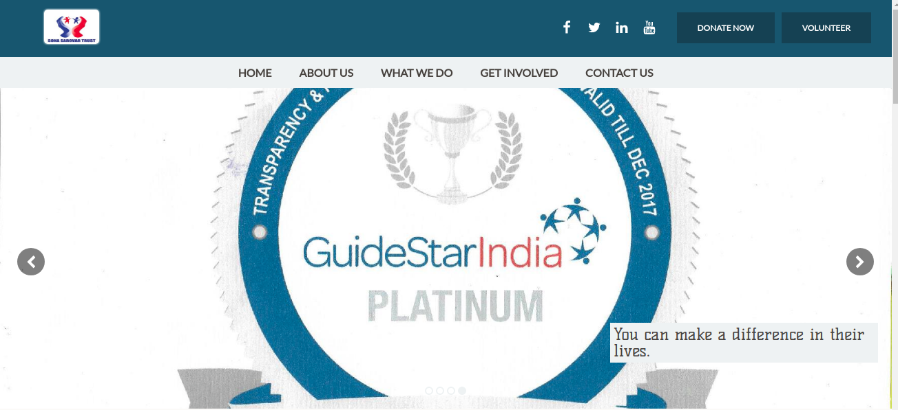

# SonaSarovarTrust

## Overview

This is a **Full Stack** single page web application for a
Non-Profit Organisation [SonaSarovarTrust](http://www.sonasarovartrust.org).

## Website's Overall Structure

The website is broken into two major sections.

### UI For Visitors

This section is accessible to both the **web admins** and **visitors**.

This section has an engaging UI where visitors can get following information -
  * Trust's aims and objectives
  * Trust's accomplishments
  * Project & Activities undertaken by the Trust
  * Ways to get in touch with the Trust's admins in case one needs
    to volunteer
  * Trust's contact info
  * Testimonials and Awards given to the Trust to validate the Trust
  * Multiple ways (online & offline) to donate to the trust, in case somebody to would
    like to make a donation

### Admin Panel to Make the Website Dynamic

This section is visible **only** to the **admins**.

A lot of activity happens in this organisation, like starting new
projects, sponsoring more children, taking part in social activites to
raise awareness, etc. And the Trust's admins keep needing to update the website
with new information (**pictures**, **announcements**, etc). Because of this
the website could not be static.

And since the site admins have limited technical knowledge, it was important
to build a simple Admin Panel for them so that they can modify the website
easily.

So we have built this section for them to be able

## Salient Features

### Single Page App

This is a [Single Page Application](https://en.wikipedia.org/wiki/Single-page_application).
This means once the website loads, when the User moves to a different route, new pages will
**not** be requested from the server. On the contrary the browser will simple load the
appropriate page.

### No Reload During Site Updates

When the website's admin is updating the website, they should not have to wait for website
reload to see the effect of changes.

### Live Preview

After making changes to the website, the admin can click on the Preview button to see the changes.
They do not have type the url of the Visitor website's url

## Technologies Used

### 1. Node

**Node** powers this website's backend. It is fun to code in. It is pretty fast which makes
websites built with it quite performant. Another advantage is that the code is isomorphic
(same language on server and client side). Not to mention that it enables us to use other
really cool technologies like (express and mongoose).

### 2. Express

**Express** is the web application framework used in this project. Express (along with
**jsonwebtoken**) makes it a breeze to write an authenticated API to handle all site
modifications.

### 3. MongoDB

**MongoDB** is the database derver of our choice since **NoSQL**  nature of it makes
it simple to build a complex but flexible database.

### 4. Mongoose

If MongoDB made building database easy, **Mongoose** has made managing database entities
super simple. Mongoose validations helps doing automatic validation on insert/update.
And mongoose middlewares like `save` allows us to write password hashing logic near the
database model and not in the application logic.

### 5. React & Redux

**React** and **Redux** helped us write complex application logic in straightforward
manner, keeping code readble and easy to modify/update.
These libraries were particularly critical with the **Admin Panel** of the website as
one major requirement was that the User Experience while updating the site should
be great. The admin should not have to wait for page reloads. This implied that requets
had to be **asynchronous**. It also made us use a flux like state management tool and
we picked redux as it works great with **React** and is fun to code with.

### 6. React Router

As mentioned above this is an SPA (Single Page Application). Making it so became pretty
straighforward using React Router.

### 7. Mocha

We use **Mocha** library for writing declarative test cases.

## Contributing

See [CONTRIBUTING.md](CONTRIBUTING.md)
